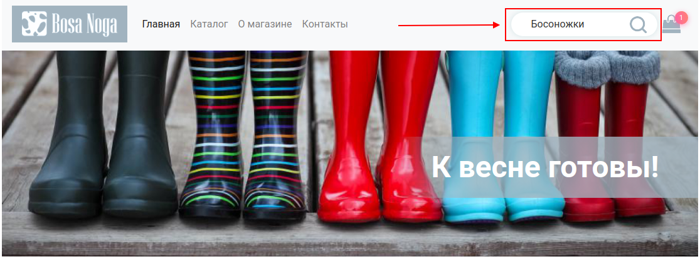
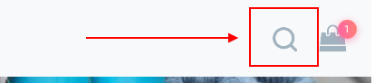

# React course project

The project is an online shoe store. The goal is to create a working application, all the main functions of which can be used.

## Content

The application contains the following independent screens (pages):

1. Main page.
1. Product catalog.
1. Information page.
1. Product page.
1. Shopping cart.
1.404

## Transitions between screens

The navigation center of the application is the header and footer of each screen (page):

From the header you can get to the following screens:
* logo and link "Home" - lead to the main page, URL - "/";
* catalog - leads to the catalog page, URL - "/catalog.html";
* about the store - leads to the page "About the store", URL - "/about.html";
* contacts - leads to the "Contacts" page, URL - "/contacts.html".

From the footer you can get to the following screens:
* about the store - leads to the page "About the store", URL - "/about.html";
* catalog - leads to the catalog page, URL - "/catalog.html";
* contacts - leads to the "Contacts" page, URL - "/contacts.html".

## Description of screens

### Main page

The Home screen is available by default when you open the app.

When loading any data using network requests, a loader is displayed. Each widget has its own loader, that is, you should not have one loader for the entire application.

After loading, the page looks like this:

General scheme:

### Catalog

The Product Catalog screen looks like this:

In fact, it completely repeats the functionality of the catalog on the main page, with one exception: it has a search field.

If the category changes, then the data is reloaded taking into account the search string.

The search bar only responds to full input, not live searches.

### Search

All pages have a search widget in the header:

By default, the search field is hidden, only the icon is displayed:

This icon works as follows: on the first click, it opens the search bar, on the second, if some text has been entered, it redirects the user to the catalog page (/catalog.html), while the search field should display the same text as was entered in the search bar in the header, and the data should be loaded based on this:

Searches on the server work on an exact match of a case-insensitive color, such as "black", and on the content of the word for a case-insensitive name, for example, one can find "heat" in "Firebird's Shoes".

If the user has not entered any text, then the search bar simply collapses back, as is now implemented in html.

### About the store, contacts

These are just content pages with content hardwired into them. There is no logic, except for the work of the search widget and links, there.

### Product page

The product page looks like this:

The page opens when you click the "Order" buttons in the product cards. The URL is /catalog/:id.html. Where id is the product ID.

On it, only the block of the product itself is of interest:

Key points:
1. When loading, the loader is shown.
1. To download full product information, you need to do GET http://localhost:7070/api/items/:id, where id is the product ID.
1. A picture is displayed on the left, there may be several pictures in the answer - you take the first one.
1. A data plate is displayed on the side, all the necessary data are listed. No others are needed. If there are no incoming goods, then just leave the field empty.
1. Sizes - displays all available sizes for which the `available` flag is equal to `true`. By default, no size is selected. Once selected, it becomes highlighted, as in the screenshot. Important: the "Add to cart" button is activated only when there are sizes in stock and a specific size is selected. Only one size can be selected.
1. Quantity - from 1 to 10.

Special cases: if no size is available, the "Quantity" block and the "Add to Cart" button are not displayed.

After clicking on the “Add to cart” button, the user is redirected to the cart page /cart.html.

### Cart Page

You can get into the basket either by ordering something, or by clicking on the basket icon in the site header.

The cart looks like this:

The "Cart" block displays the items in the cart. All products are stored locally in localStorage. The product can be removed from the cart, then it should be removed from localStorage too.

One position is considered a pair - product + size. That is, if you buy the same sandals in a different size, then it will be two positions in the basket. And if you buy sandals of the same size twice, the quantity and total cost will change, but the record will remain